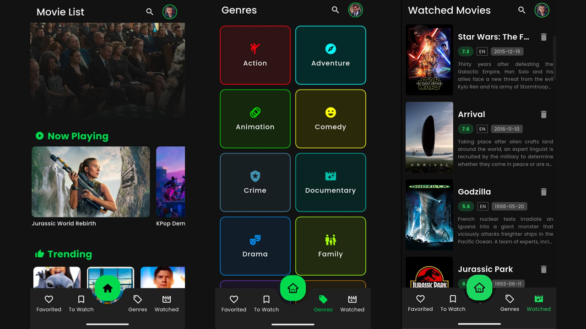

# Movie Diary App

A mobile application built with Flutter that allows users to track movies they have watched, manage a personal watchlist, and explore movie information using the TMDB API.

---

## 📌 Description

Movie Diary is a personal movie tracker designed for students and casual movie watchers.  
Users can browse movies, view details, and save movies into their own list for future reference.

This project is developed as a final diploma project.

---

## ✨ Features

- Browse popular, top-rated, upcoming and now-playing movies
- View detailed movie information (title, overview, rating, poster)
- Add movies to personal watchlist
- Simple and clean user interface
- Firebase authentication (login & sign up)

---

## 🖼 Screenshots

